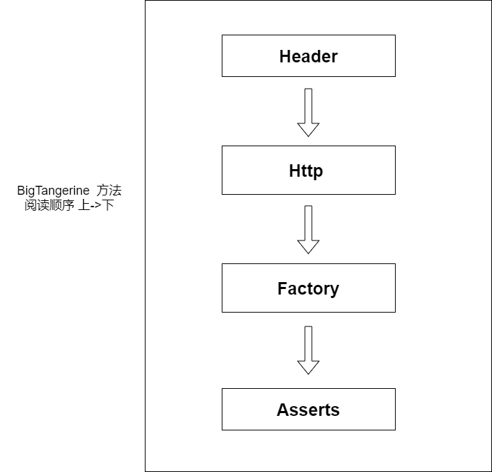
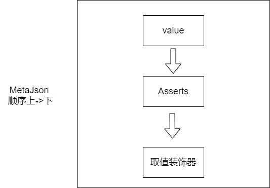
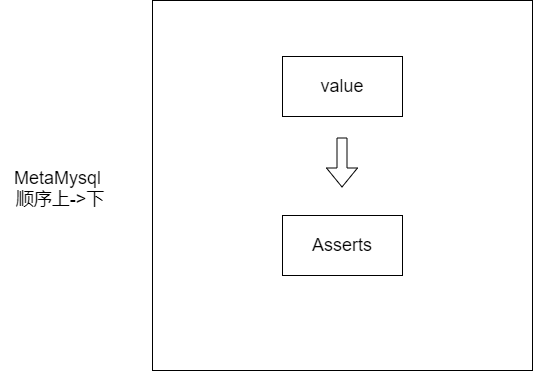

# 1 功能介绍
封装了一些，测试人员写自动化代码的常用功能作为装饰器，目标是能让测试人员更关注业务逻辑的实现，隐藏和业务逻辑无关的细节

# 2 主要思想

通过[BigTangerine](#BigTangerine) 来定义接口， 然后通过[MetaData](#MetaData) 来定义需要验证的数据对象，在[BigTangerine](#BigTangerine)中定义的接口。

# 3 主要使用类
## <a id="BigTangerine" style="color:black">3.1 BigTangerine</a>

主要的入口类，所有的装饰器都是应用在该类或其子类的方法上
示例代码

```python
class MockService(BigTangerine):
    @cjen.http.base_url(uri="http://127.0.0.1:5000")
    def __init__(self): super().__init__()

    @cjen.headers.contentType(value="application/json")
    @cjen.http.post_mapping(uri="post_method_json")
    def post_method_json(self, *, data, resp=None, **kwargs):
        assert resp.get("procCode") == 200
```
### 3.1.1 如何定义

```python
#  继承BigTangerine
class 自定义类名(BigTangerine):
    #  定义__init__函数，通常在该函数定义访问的连接和定义基准的Header
    @cjen.http.base_url(uri="http://127.0.0.1:5000") # 定义访问连接
    @cjen.headers.basicHeaders(headers=dict(Header的名=Header的值)) # 定义基准的Header
    def __init__(self): super().__init__()
    
    # 定义方法. 直接返回接口数据
    #    不需要传入参数
    # 且 不需要生成meta对象
    # 且 不需要逻辑处理
    @cjen.http.(get|put|delete|uploading)_mapping(uri="api连接名")
    def 方法名(self,*, resp=None, **kwargs): ...
    
    # 定义方法. 传入参数为json，仍会返回接口返回数据，自定义逻辑
    # 不需要生成meta对象
    # data为固定参数名称
    @cjen.http.(get|put|delete|uploading)_mapping(uri="api连接名")
    def 方法名(self,*,data, resp=None, **kwargs): 
        ## 自定义操作代码 resp 为接口返回的数据 ##
    
    # 定义方法. api带有参数，仍会返回接口返回数据，自定义逻辑
    # 不需要生成meta对象
    # path_variable为固定参数名称
    @cjen.http.(get|put|delete|uploading)_mapping(uri="api连接名")
    def 方法名(self,*,path_variable, resp=None, **kwargs): 
        ## 自定义操作代码 resp 为接口返回的数据 ##
    
    # 定义方法. 带有Meta 对象，已MetaJson为例
    @cjen.http.(get|put|delete|uploading)_mapping(uri="api连接名")
    def 方法名(self,*, meta对象名:Meta类型 resp=None, **kwargs): ...
```

<p style="color: red">在方法定义中，如果使用了<a href="###4.3.2 Http 装饰器">Http装饰器</a>，则不要在方法中去return, 因为该架构目标设计是在方法中添加测试验证，而不是取值操作，值的传递可以使用 <a href="###3.1.3 上下文">上下文</a> 控制</p>

### 3.1.2 上下文

如果接口有依赖关系，则可以使用"上下文"来做值传递

```python
class Customer(BigTangerine):
    # 通过 装饰器添加 context
    @orange.context.add(content=dict(key=value))
    def __init__(self): super().__init__()
    
    # 通过 方法控制
    def controal_context(self): self.context.update(dict(kev=value))
```


## <a id="MetaData" style="color:black">3.2 MetaData</a>

### 3.2.1 MetaJson
根据Json对象生成的数据对象,可用json_path来获取期望的值
```python
class C01Employees(MetaJson):

    @cjen.operate.common.value
    @cjen.operate.json.many(json_path="$.employees[?(@.company_id==1)]", filter_keys=["name", "company_id"])
    def employees(self): ...

    @cjen.operate.common.value
    @cjen.operate.json.one(json_path="$.procCode")
    def procCode(self): ...
```
 <span style="color: red"> 不兼容 Python  自带装饰器 @property </span>

### 3.2.2 MetaMysql

查询mysql数据库生成数据对象
```python
class Company(MetaMysql):

    @cjen.operate.common.value
    def id(self): ...

    @cjen.operate.common.value
    def name(self): ...
```

<span style="color: red"> 不兼容 Python  自带装饰器 @property </span>

# 4 装饰器

## 4.1 BigTangerine装饰器





### 4.3.1 Header 装饰器

| 装饰器                           | 参数                    | 作用                                                     | 代码示例                                    |
| -------------------------------- | ----------------------- | -------------------------------------------------------- | ------------------------------------------- |
| @cjen.headers.basicHeaders       | headers(required): dict | 初始化 Basic Header, Basic Header 是作为基准 Header 存在 | [定义基准Headers](#BasicHeader)             |
| @cjen.headers.appendBasicHeaders | headers(required): dict | 增加 Basic Header                                        | [增加基准Headers](#AppendBasicHeader)       |
| @cjen.headers.addHeaders         | headers(required): dict | 新增临时 Header                                          | [添加临时Headers](#AddTempHeader)           |
| @cjen.headers.contentType        | value(required): str    | 新增临时 Content-Type Header                             | [添加临时Content-Type](#AddTempContentType) |
| @cjen.headers.accept             | value(required): str    | 新增临时 Accept Header                                   | [添加临时Accept](#AddTempAccept)            |


### 4.3.2 Http 装饰器

| 装饰器                    | 参数               | 作用                           | 代码示例                                                     |
| ------------------------- | ------------------ | ------------------------------ | ------------------------------------------------------------ |
| @cjen.http.post_mapping   | uri(required): str | 发送 Post 请求，并返回结果     | <ul><li><a href="#PostMapping">下载文件</a></li><li><a href="##POST 请求">带参数url</a></li><li><a href="##POST 请求">请求体为JSON</a></li></ul> |
| @cjen.http.get_mapping    | uri(required): str | 发送 GET 请求，并返回结果      | <a href="##GET 请求">带参url</a>                             |
| @cjen.http.put_mapping    | uri(required): str | 发送 PUT 请求，并返回结果      | <ul><li><a href="##PUT 请求">带参URL</a></li><li><a href="##PUT 请求">请求体为JSON</a></li></ul> |
| @cjen.http.delete_mapping | uri(required): str | 发送 delete 请求，并返回结果   | <ul><li><a href="##DELETE 请求">带参URL</a></li><li><a href="##DELETE 请求">请求体为JSON</a></li></ul> |
| @cjen.http.upload_mapping | uri(required): str | 发送 上传文件 请求，并返回结果 | [上传文件](##上传文件)                                       |
| @cjen.http.base_url       | uri(required): str | 设置访问的地址                 | <a href="##POST 请求">设置访问地址</a>                       |


### 4.3.3 Factory 装饰器

| 装饰器                      | 参数                                                         | 作用              | 代码示例                                            |
| --------------------------- | ------------------------------------------------------------ | ----------------- | --------------------------------------------------- |
| @cjen.operate.mysql.factory | <ul><li>cursor(required): pymysql.cursors.Cursor</li><li>clazz(required): MetaMysql</li><li>sql(required): str</li><li>params(Optinal)</li><li>size(optinal): int, 1 or -1, default 1</li><li>track(optinal): boolean default False</li></ul> | 创建MetaMysql对象 | <ul><li><a href="## Factory 创建 Mysql Meta">一条记录</a></li><li><a href="## Factory 创建 Mysql Meta">多条记录</a></li><li><a href="## Factory 创建 Mysql Meta">SQL带参数查询</a></li></ul>|
| @cjen.operate.json.factory  | clazz(required): MetaJson                                    | 创建 MetaJson对象 | <a href="##Factory 创建 Json Meta">创建Json对象</a>                                        |


### 4.3.4 Asserts 装饰器

| 装饰器                                | 参数                                                         | 作用                               | 代码示例                                                     |
| ------------------------------------- | ------------------------------------------------------------ | ---------------------------------- | ------------------------------------------------------------ |
| @cjen.operate.asserts.validation_meta | <ul><li>meta_name(required): str</li><li>fields(optinal): str</li></ul> | 执行某一个Meta 对象的assert 装饰器 | <ul><li><a href="###BigTangerine 使用">执行指定属性的断言</a></li><li><a href="###BigTangerine 使用">所有的断言</a></li></ul> |


## 4.2 MetaJson 装饰器



###  4.2.1 (value)返回值装饰器 

| 装饰器                     | 参数            | 作用                                                         | 代码示例                          |
| -------------------------- | --------------- | ------------------------------------------------------------ | --------------------------------- |
| @cjen.operate.common.value | 无参数          | 返回值                                                       |                                   |
| @cjen.operate.json.listOf  | clazz(required) | 当返回值为多个时，生成对象 list，需配合 @cjen.operate.json.many 使用 | [转换为对象list](###值选择装饰器) |

### 4.2.2 值选择装饰器

| 装饰器                  | 参数                                                         | 作用                         | 代码示例                      |
| ----------------------- | ------------------------------------------------------------ | ---------------------------- | ----------------------------- |
| @cjen.operate.json.one  | json_path(required): str                                     | 从json对象中某一个值         | [选取指定值](###值选择装饰器) |
| @cjen.operate.json.many | <ul><li>json_path(required): str</li><li>filter_keys(optinal): list[str]</li></ul> | 从json对象中获取满足条件的值 | [提取多个值](###值选择装饰器) |


### 4.2.3  Asserts

| 装饰器                             | 参数                        | 作用       | 代码示例                                  |
| ---------------------------------- | --------------------------- | ---------- | ----------------------------------------- |
| @cjen.operate.asserts.equal        | value(required): str or int | 等于       | <a href="##Asserts 装饰器">等于</a>       |
| @cjen.operate.asserts.not_equal    | value(required): str or int | 不等于     | <a href="##Asserts 装饰器">不等于</a>     |
| @cjen.operate.asserts.in_range     | value(required): list       | 在范围中   | <a href="##Asserts 装饰器">在范围内</a>   |
| @cjen.operate.asserts.not_in_range | value(required): list       | 不在范围中 | <a href="##Asserts 装饰器">不在范围内</a> |
| @cjen.operate.asserts.required     | 无参数                      | 必填       | <a href="##Asserts 装饰器">必填</a>       |


## 4.3 MetaMysql 装饰器



| 装饰器                     | 参数   | 作用                                                     | 代码示例 |
| -------------------------- | ------ | -------------------------------------------------------- | -------- |
| @cjen.operate.common.value | 无参数 | 如果期望Meta Data 的Field 返回值，则需要顶层使用该装饰器 |          |


### 4.3.2 Asserts

| 装饰器                             | 参数                        | 作用       | 代码示例                                  |
| ---------------------------------- | --------------------------- | ---------- | ----------------------------------------- |
| @cjen.operate.asserts.equal        | value(required): str or int | 等于       | <a href="##Asserts 装饰器">等于</a>       |
| @cjen.operate.asserts.not_equal    | value(required): str or int | 不等于     | <a href="##Asserts 装饰器">不等于</a>     |
| @cjen.operate.asserts.in_range     | value(required): list       | 在范围中   | <a href="##Asserts 装饰器">在范围内</a>   |
| @cjen.operate.asserts.not_in_range | value(required): list       | 不在范围中 | <a href="##Asserts 装饰器">不在范围内</a> |
| @cjen.operate.asserts.required     | 无参数                      | 必填       | <a href="##Asserts 装饰器">必填</a>       |

## 4.4 上下文装饰器

# 5 代码示例

##  <a id="BasicHeader" style="color:black">定义基准Headers</a>

```python
class HeaderMockService(BigTangerine):
	# 初始化基准Header
    @cjen.headers.basicHeaders(headers=dict(Basicheader="1"))
    def __init__(self): super().__init__()
```


## <a id="AppendBasicHeader" style="color:black">增加基准Headers</a>

```python
class HeaderMockService(BigTangerine):

    @cjen.headers.basicHeaders(headers=dict(Basicheader="1"))
    def __init__(self): super().__init__()
	
	# 在请求的Header中添加基准Header
    @cjen.headers.appendBasicHeaders(headers=dict(Appendbasicheaders="2"))
    @cjen.http.get_mapping(uri="test_headers")
    def append_basic_headers(self, resp=None, **kwargs):
        assert resp.get("headers")["Basicheader"] == self.headers["Basicheader"]
        assert resp.get("headers")["Appendbasicheaders"] == self.headers["Appendbasicheaders"]
```


## <a id="AddTempHeader" style="color:black">添加临时Headers</a>

```python
class HeaderMockService(BigTangerine):

    @cjen.http.base_url(uri="http://127.0.0.1:5000")
    @cjen.headers.basicHeaders(headers=dict(Basicheader="1"))
    def __init__(self): super().__init__()
	
    # 在请求的Header中添加临时的Header
    @cjen.headers.addHeaders(headers=dict(Newheader="3"))
    @cjen.http.get_mapping(uri="test_headers")
    def add_headers(self, resp=None, **kwargs):
        assert resp.get("headers")["Basicheader"] == self.headers["Basicheader"]
        assert resp.get("headers")["Newheader"] == "3"
        assert self.headers.get("Newheader") is None
```

##　<a id="AddTempContentType" style="color:black">添加临时Content-Type</a>

```python
class HeaderMockService(BigTangerine):

    @cjen.http.base_url(uri="http://127.0.0.1:5000")
    @cjen.headers.basicHeaders(headers=dict(Basicheader="1"))
    def __init__(self): super().__init__()

	# 在请求的Header中添加临时 Content-Type
    @cjen.headers.contentType(value="application/json")
    @cjen.http.get_mapping(uri="test_headers")
    def add_content_type(self, resp=None, **kwargs):
        assert resp.get("headers")["Basicheader"] == self.headers["Basicheader"]
        assert resp.get("headers")["Content-Type"] == "4"
        assert self.headers.get("Content-Type") is None
```


## <a id="AddTempAccept" style="color:black">添加临时Accept</a>

```python
class HeaderMockService(BigTangerine):

    @cjen.http.base_url(uri="http://127.0.0.1:5000")
    @cjen.headers.basicHeaders(headers=dict(Basicheader="1"))
    def __init__(self): super().__init__()

	# 在请求的Header中添加临时 Accept
    @cjen.headers.accept(value="5")
    @cjen.http.get_mapping(uri="test_headers")
    def add_accept(self, resp=None, **kwargs):
        assert resp.get("headers")["Basicheader"] == self.headers["Basicheader"]
        assert resp.get("headers")["Accept"] == "5"
        assert self.headers.get("Accept") is None
```


## <a id="GetMapping" style="color:black">GET请求</a>

```python
class MockService(BigTangerine):
    # 设置访问的 http 地址
    @cjen.http.base_url(uri="http://127.0.0.1:5000")
    def __init__(self): super().__init__()
	
    # 请求带参url
    # 1. 定义api路径
    # 方法定义如 get_method_path_variable, 
    # 参数定义 path_variable:dict,需定义该参数 
    #         resp, **kwargs 为固定写法
    # 调用：MockService().get_method_path_variable(path_variable=dict(id=1))
    @cjen.http.get_mapping(uri="get_method_path_variable?id={id}")
    def get_method_path_variable(self, *, path_variable: dict, resp=None, **kwargs):
        assert resp.get("procCode") == 200
        assert resp.get("path_variable") == path_variable.get("id")
	
    # 请求带参url
    # 1. 定义api路径
    # 方法定义如 get_method_variable, 
    # 参数定义 path_variable:dict,需定义该参数 
    #         resp, **kwargs 为固定写法
    # 调用：MockService().get_method_variable(path_variable=dict(id=1))
    @cjen.http.get_mapping(uri="get_method_variable/{id}")
    def get_method_variable(self, *, path_variable: dict, resp=None, **kwargs):
        assert resp.get("procCode") == 200
        assert resp.get("path_variable") == path_variable.get("id")

```


## <a id="PostMapping" style="color:black">POST请求</a>

```python
class MockService(BigTangerine):
    # 设置访问的 http 地址
    @cjen.http.base_url(uri="http://127.0.0.1:5000")
    def __init__(self): super().__init__()
	
    # 请求体为json
    # 1. 设置Content Type 为JSON
    # 2. 定义api路径
    # 方法定义如 post_metod_json, 
    # 参数定义 data:dict,需定义该参数 
    #         resp, **kwargs 为固定写法
    #调用: MockService().post_method_json(data=dict(username="xx", pwd="yyy"))
    @cjen.headers.contentType(value="application/json")
    @cjen.http.post_mapping(uri="post_method_json")
    def post_method_json(self, *, data, resp=None, **kwargs):
        assert resp.get("procCode") == 200
	
    # 请求带参url
    # 1. 定义api路径
    # 方法定义如 post_method_variable, 
    # 参数定义 path_variable:dict,需定义该参数 
    #         resp, **kwargs 为固定写法
    # 调用：MockService().post_method_variable(path_variable=dict(id=1))
    @cjen.http.post_mapping(uri="post_method_variable/{id}")
    def post_method_variable(self, *, path_variable: dict, resp=None, **kwargs):
        assert resp.get("procCode") == 200
        assert resp.get("path_variable") == path_variable.get("id")
	
    # 请求带参url
    # 1. 定义api路径
    # 方法定义如 post_method_path_variable, 
    # 参数定义 path_variable:dict,需定义该参数 
    #         resp, **kwargs 为固定写法
    # 调用：MockService().post_method_path_variable(path_variable=dict(id=1))
    @cjen.http.post_mapping(uri="post_method_path_variable?id={id}")
    def post_method_path_variable(self, *, path_variable: dict, resp=None, **kwargs):
        assert resp.get("procCode") == 200
        assert resp.get("path_variable") == path_variable.get("id")
    
    # 下载
    # 1. 定义api路径
    # 方法定义如 download_file, 
    # 参数定义 resp, **kwargs 为固定写法
    # 在方法体中定义文件存储
    # 调用：MockService().download_file()
    @cjen.http.post_mapping(uri="download_file")
    def download_file(self, *, resp=None, **kwargs):
        path = os.path.join(os.path.dirname(__file__), "test_download_file")
        with open(path, "wb") as f:
            f.write(resp)
```


## <a id="PutMapping" style="color:black">PUT请求</a>

```python
class MockService(BigTangerine):
    @cjen.http.base_url(uri="http://127.0.0.1:5000")
    def __init__(self): super().__init__()

	# 请求体为json
    # 1. 设置Content Type 为JSON
    # 2. 定义api路径
    # 方法定义如 put_method_json, 
    # 参数定义 data:dict,需定义该参数 
    #         resp, **kwargs 为固定写法
    #调用: MockService().put_method_json(data=dict(username="xx", pwd="yyy"))
    @cjen.headers.contentType(value="application/json")
    @cjen.http.put_mapping(uri="put_method_json")
    def put_method_json(self, *, data, resp=None, **kwargs): ...
	
    # 请求带参url
    # 1. 定义api路径
    # 方法定义如 put_method_variable, 
    # 参数定义 path_variable:dict,需定义该参数 
    #         resp, **kwargs 为固定写法
    # 调用：MockService().put_method_variable(path_variable=dict(id=1))
    @cjen.http.put_mapping(uri="put_method_variable/{id}")
    def put_method_variable(self, *, path_variable, resp=None, **kwargs): ...
	
    # 请求带参url
    # 1. 定义api路径
    # 方法定义如 put_method_path_variable, 
    # 参数定义 path_variable:dict,需定义该参数 
    #         resp, **kwargs 为固定写法
    # 调用：MockService().put_method_path_variable(path_variable=dict(id=1))
    @cjen.http.put_mapping(uri="put_method_path_variable?id={id}")
    def put_method_path_variable(self, *, path_variable, resp=None, **kwargs): ...
```

## <a id="DeleteMapping" style="color:black">DELETE请求</a>

```python
class MockService(BigTangerine):
    @cjen.http.base_url(uri="http://127.0.0.1:5000")
    def __init__(self): super().__init__()
    
    # 请求体为json
    # 1. 设置Content Type 为JSON
    # 2. 定义api路径
    # 方法定义如 delete_method_json, 
    # 参数定义 data:dict,需定义该参数 
    #         resp, **kwargs 为固定写法
    #调用: MockService().delete_method_json(data=dict(username="xx", pwd="yyy"))
    @cjen.headers.contentType(value="application/json")
    @cjen.http.delete_method_json(uri="delete_method_json")
    def delete_method_json(self, *, data, resp=None, **kwargs): ...
	
    # 请求带参url
    # 1. 定义api路径
    # 方法定义如 delete_method_variable, 
    # 参数定义 path_variable:dict,需定义该参数 
    #         resp, **kwargs 为固定写法
    # 调用：MockService().delete_method_variable(path_variable=dict(id=1))
    @cjen.http.delete_mapping(uri="delete_method_variable/{id}")
    def delete_method_variable(self, *, path_variable: dict, resp=None, **kwargs): ...
	
    # 请求带参url
    # 1. 定义api路径
    # 方法定义如 delete_method_path_variable, 
    # 参数定义 path_variable:dict,需定义该参数 
    #         resp, **kwargs 为固定写法
    # 调用：MockService().delete_method_path_variable(path_variable=dict(id=1))
    @cjen.http.delete_mapping(uri="delete_method_path_variable?id={id}")
    def delete_method_path_variable(self, *, path_variable: dict, resp=None, **kwargs): ...
```


## <a id="UploadMapping" style="color:black">上传文件</a>

```python
class MockService(BigTangerine):
    @cjen.http.base_url(uri="http://127.0.0.1:5000")
    def __init__(self): super().__init__()
    
    # 1. 定义api路径
    # 方法定义如 upload_file, 
    # 参数定义 data:dict,需定义该参数,该参数中应该包含文件路径, file 是必须的 
    #         resp, **kwargs 为固定写法
    #调用: MockService().delete_method_json(data=dict(username="xx", pwd="yyy"))
    @cjen.http.upload_mapping(uri="upload_file")
    def upload_file(self, *, data, resp=None, **kwargs): ...

if __name__== '__main__':
    mock = MockService()
    # 关键字 file 是必须的
    mock.upload_file(data=dict(file=os.path.join(os.path.dirname(__file__), "upload_source.txt")))
        
```


## MetaMysql

### Factory创建MysqlMeta

```python
import os

import cjen
from cjen import DatabasePool, BigTangerine, MetaMysql

from cjen.bigtangerine import ContextArgs
from cjen.nene.helper import FileHelper

# 创建 数据库连接
def cursor():
    return DatabasePool.cursor(host="127.0.0.1", port=3306, user='root', pwd='123456', database='cjen_test_sql')

# 创建 Company 对象
class Company(MetaMysql):

    @cjen.operate.common.value
    def id(self): ...

    @cjen.operate.common.value
    def name(self): ...

# 创建 Employee 对象
class Employee(MetaMysql):
    @cjen.operate.common.value
    def id(self): ...

    @cjen.operate.common.value
    def name(self): ...

    @cjen.operate.common.value
    def company(self): ...


class CMysql(BigTangerine):

    def __init__(self): super().__init__()
	
    #　返回一条记录，用一条记录生成　Mysql Meta 对象
    @cjen.operate.mysql.factory(cursor=cursor(), clazz=Company, sql="SELECT * FROM company WHERE id = 1")
    def get_one_company(self, company: Company, **kwargs): ...
	
    #　返回多条记录，生成一组 list[Mysql Meta] 对象
    #  size = -1 表示 返回的所有值
    #  clazz 表示 生成的对象
    # 方法定义中：companies: list[Company] 后面的类型指定是必须的
    @cjen.operate.mysql.factory(cursor=cursor(), size=-1, clazz=Company, sql="SELECT * FROM company")
    def get_many_companies(self, companies: list[Company], **kwargs): ...

	# 带参数SQL查询，手动固定参数
    @cjen.operate.mysql.factory(cursor=cursor(), clazz=Employee, 																			sql=FileHelper.read(os.path.dirname(__file__), "employees.sql"),
                                params=[2, 3], size=-1)
    def get_e0203_employee(self, employees: list[Employee], **kwargs): ...

   
	# 带参数SQL查询，参数来自上下文
    # params: ContexArgs(key: sql中的查询参数 = value: 上下文中的取值参数名) 
    @cjen.operate.mysql.factory(cursor=cursor(), clazz=Employee,
                                sql=FileHelper.cur_read(cur=__file__, file="employees_of_company.sql"),
                                params=ContextArgs(id="company_id"), size=-1)
    def get_c01_employees(self, employees: list[Employee], **kwargs): ...
	
    # 设置上下文中的参数
    @cjen.context.add(content=dict(company_id=1))
    def set_company_id(self): ...


```


## MetaJson

### Factory创建JsonMeta

```python
# 定义 MetaJson 对象
class Company(MetaJson):

    @cjen.operate.common.value
    @cjen.operate.json.one(json_path="$.procCode")
    def procCode(self): ...

    @cjen.operate.common.value
    @cjen.operate.json.one(json_path="$.id")
    def id(self): ...

    @cjen.operate.common.value
    @cjen.operate.json.one(json_path="$.name")
    def name(self): ...

class JsonMockService(BigTangerine):
    @cjen.http.base_url(uri="http://127.0.0.1:5000")
    def __init__(self):
        super().__init__()

    @cjen.http.get_mapping(uri="company/{company_id}")
    # 创建 MetaJson 对象
    @cjen.operate.json.factory(clazz=Company)
    def get_company(self, *, path_variable: dict, resp=None, company: Company = None, **kwargs): ...
```

### 值选择装饰器

```python
class C01Employees(MetaJson):
    
    # 获取匹配的多个值
    # filter_keys: 获取指定的Key-Value，如果不设置的则获取所有的Key-Value
    @cjen.operate.json.many(json_path="$.employees[?(@.company_id==1)]", filter_keys=["name", "company_id"])
    def employees(self): ...
	
    # 选择json对象中的指定值
    @cjen.operate.json.one(json_path="$.procCode")
    def procCode(self): ...
    
    # 把 @cjen.operate.json.many 中提取的值，转化为 Company list 对象 
    @cjen.operate.json.listOf(clazz=Company)
    @cjen.operate.json.many(json_path="$.employees[?(@.company_id==1)]", filter_keys=["name", "company_id"])
    def companies(self): ...
```


## Asserts装饰器

### Meta对象使用

```python
class CompanyC01(MetaMysql):

    @cjen.operate.common.value
    @cjen.operate.asserts.not_equal(value=1)
    @cjen.operate.asserts.required # 必填
    def id(self): ...

    @cjen.operate.common.value
    @cjen.operate.asserts.equal(value="C01") # 相等
    @cjen.operate.asserts.in_range(ranges=["C01", "C02", "C03", "C04"]) # 在范围值内
    def name(self): ...

class Employee(MetaMysql):
    @cjen.operate.common.value
    def id(self): ...

    @cjen.operate.common.value
    @cjen.operate.asserts.not_in_range(ranges=["C01", "C02", "C03", "C04"]) # 不在范围值内
    def name(self): ...


```

### BigTangerine使用

```python
class AssertMockService(BigTangerine):

    @cjen.http.base_url(uri="http://127.0.0.1:5000")
    def __init__(self): super().__init__()


    @cjen.http.get_mapping(uri="none_field_response")
    @cjen.operate.mysql.factory(cursor=cursor(), clazz=CompanyC01,
                                sql="SELECT * FROM company WHERE id = 1",
                                params=dict(id=1))
    @cjen.operate.json.factory(clazz=ResponseNone)
    @cjen.operate.asserts.validation_meta(meta_name="company", fields="id;name") #  检查指定的fields,
    @cjen.operate.asserts.validation_meta(meta_name="resp_null") # 检查所有的fields
    def validation_appoint(self, resp=None, company: CompanyC01 = None, resp_null: ResponseNone = None, **kwargs): ...
```

